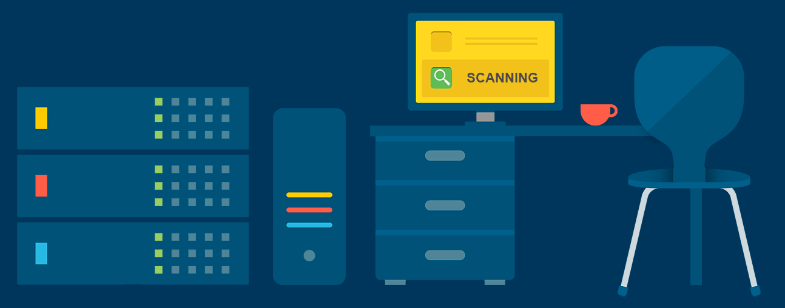

<!--  -->
<h1 align="center">Hi, I'm MD SOYAIB RAHMAN</h1>
<h3 align="center">Jr. Software Engineer @Affpilot AI || Backend || Go • Python • Gin • FastAPI • Docker • RabbitMQ • ICPC Dhaka Regionalist</h3>

  

<!--
  
-->

- 🌱 I’m currently learning **Go, Gin, Backend Stuffs**

- 📝 I sometimes write articles on [Medium](https://medium.com/@soyaibzihad10), [The Roar](https://www.theroar.com.au/author/soyaibzihad101406/)

- 💬 Ask me about **CP, Go, Sports, Physics**

- 📫 How to reach me **soyaibzihad10@gmail.com**

- ⚡ Fun fact **I can fix my code – but not my coffee addiction!**

 
 

 

 
  
  

 

 
<h2 align="center">⚒️ Languages-Frameworks-Tools ⚒️</h2>
 

<!--      -->
    
     
<!--     
    

 

<h2 align="center">⚡ Stats ⚡</h2>

&nbsp;

<!--

-->
